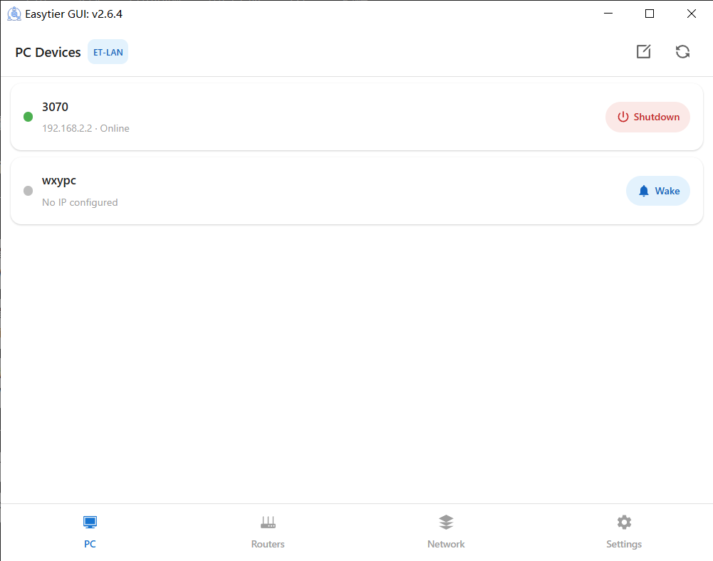
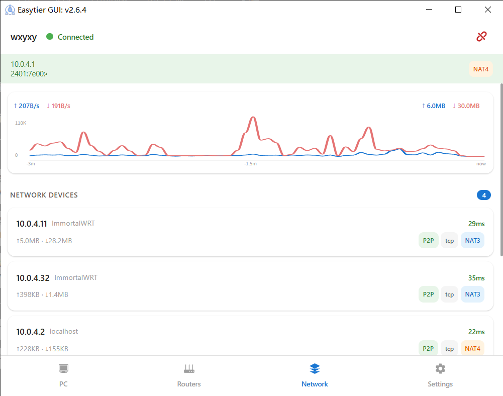
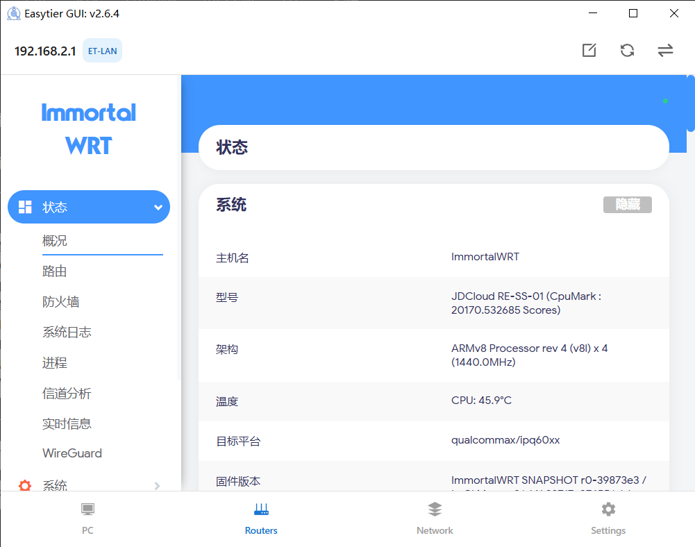
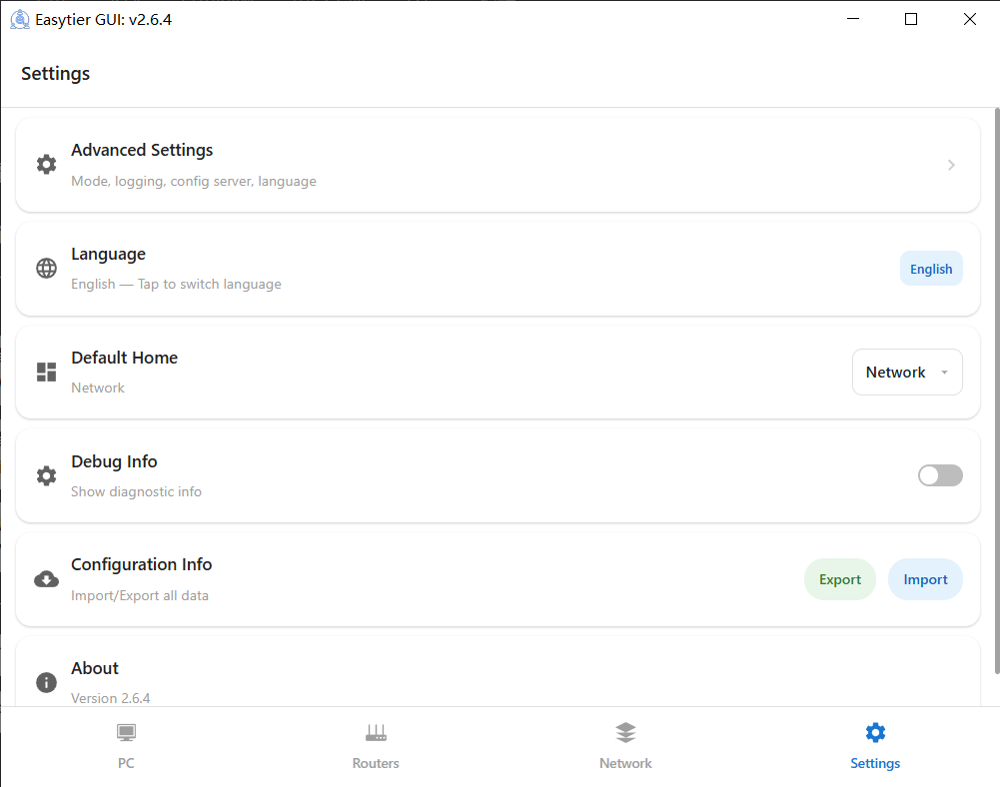

# EasyTier + WOLPlus

[](https://github.com/EasyTier/EasyTier/releases)
[](https://github.com/EasyTier/EasyTier/blob/main/LICENSE)
[](https://github.com/EasyTier/EasyTier/commits/main)
[](https://github.com/EasyTier/EasyTier/issues)
[](https://github.com/EasyTier/EasyTier/actions/workflows/core.yml)
[](https://github.com/EasyTier/EasyTier/actions/workflows/gui.yml)
[](https://github.com/EasyTier/EasyTier/actions/workflows/test.yml)
[](https://deepwiki.com/EasyTier/EasyTier)

[简体中文](README.md) | [English](../README.md)

> ✨ 基于 Rust + Tauri v2 的跨平台异地组网与远程设备管理一体化应用 —— EasyTier 组网能力 + WOLPlus 设备唤醒管理

## 项目简介

本项目是 [EasyTier](https://github.com/EasyTier/EasyTier) 的功能增强分支，在保留 EasyTier 全部组网能力的基础上，深度整合了 **WOL（网络唤醒）设备管理**、**LuCI 路由器反向代理管理**、**一键配置导入/导出** 等实用功能，并进行了全面的 Material Design 界面美化。

应用基于 **Tauri v2** 框架构建，支持 **Windows / macOS / Linux 桌面端** 和 **Android 移动端**，通过 CI 全平台自动构建发布（详见 [CI 全平台构建文档](../docs/CI全平台构建.md)）。App 内嵌 easytier-core 实现去中心化组网，无需中心服务器。

### CI 全平台构建矩阵

| 平台 | 产物 | 架构 |
|------|------|------|
| 🐧 Linux | deb / rpm / AppImage | x86_64, aarch64 |
| 🍎 macOS | dmg | x86_64, aarch64 |
| 🪟 Windows | nsis installer (.exe) | x86_64, i686, aarch64 |
| 📱 Android | APK | aarch64, armv7, i686, x86_64 |
| 🔧 CLI | 二进制 | 16 个目标 (含 MIPS/LoongArch/RISC-V/FreeBSD) |
| 🧩 Magisk | 模块 | 通用 |

### 四大功能模块

| Tab | 图标 | 功能 |
|-----|------|------|
| 💻 **电脑** | desktop | WOL 设备管理：远程唤醒、关机、在线状态实时监控 |
| 🌐 **组网** | network | EasyTier 网络管理：一键连接、Peer 列表、实时速率图表 |
| 🖥️ **LuCI** | router | 路由器管理面板：HTTP 反向代理 iframe，多路由器切换 |
| ⚙️ **设置** | settings | 配置导入导出、语言切换、默认首页、Debug 开关、关于 |

## 界面截图

<p align="center">
  
  
</p>
<p align="center">
  
  
</p>

## 核心特性

### EasyTier 组网能力（原版保留）

- 🔒 **去中心化**：节点平等独立，无需中心化服务
- 🚀 **易于使用**：一键连接组网，Web / 客户端 / 命令行多种操作方式
- 🌍 **跨平台**：支持 Win / MacOS / Linux / FreeBSD / Android 及 X86 / ARM / MIPS / RISC-V 架构
- 🔐 **安全**：AES-GCM 或 WireGuard 加密，防止中间人攻击
- 🔌 **高效 NAT 穿透**：支持 UDP 和 IPv6 穿透，NAT4-NAT4 也能打通
- 🌐 **子网代理**：节点可共享子网供其他节点访问
- 🔄 **智能路由**：延迟优先，自动选择最优路径
- ⚡ **高性能**：全链路零拷贝，支持 TCP / UDP / WSS / WG 协议

### 新增增强功能

- 💻 **WOL 设备管理**：远程唤醒/关机局域网 PC，30 秒自动轮询在线状态，详见下方 WOLPlus 联动说明
- 🖥️ **LuCI 代理管理**：通过 EasyTier 隧道反向代理路由器 LuCI 面板，支持多路由器切换、自动登录与 Cookie 会话保持、刷新后恢复上次浏览路径
- 🌓 **暗色模式**：自动跟随系统深色模式，Material Design 卡片风格
- 🌐 **中英双语**：自定义 i18n 系统，所有界面文字即时切换（非 easytier-frontend-lib 的 i18n）
- 📦 **一键配置导入/导出**：WOL 设备 + LuCI 路由器 + EasyTier 网络配置打包为 JSON，通过剪贴板导入导出
- 📊 **实时速率图表**：60 点 / 3 分钟上下行速率折线图，SVG 渲染，左侧固定 20px Y 轴标签区
- 🎨 **网络质量可视化**：延迟/丢包率颜色分级（绿/蓝/橙/红），NAT 类型芯片标签，P2P/Relay 隧道标签
- 🔄 **路径模式自动识别**：EasyTier 隧道（ET-LAN）与局域网直连（LAN）双模式自适应

## WOL 设备管理 —— WOLPlus + Agent 联动

WOL 功能的实现依赖路由器端的 `luci-app-wolplus` CGI 中间层和 PC 端的 `wol-agent`（Go 编写）协同工作，组成完整的 **唤醒 → 状态检测 → 关机** 操作闭环。

### 整体架构

```
手机 / 桌面 App (easytier-gui)
  │
  ├── 唤醒 PC：HTTP GET → 路由器 CGI → etherwake 发送魔术包
  ├── 状态检测：HTTP GET → PC Agent (32249端口) → 返回在线状态
  └── 远程关机：HTTP POST → PC Agent (32249端口) → shutdown /s /t 5

路由器 (OpenWrt / ImmortalWRT)
  ├── easytier-core（组网节点，官方二进制）
  ├── luci-app-wolplus（CGI API: /cgi-bin/wolplus-api）
  │     ├── action=wake&mac=XX:XX:XX:XX:XX:XX&iface=br-lan → etherwake
  │     ├── action=status&ip=192.168.2.X&port=32249          → curl Agent
  │     └── action=shutdown&ip=192.168.2.X&port=32249        → curl Agent POST
  └── etherwake + curl

PC (Windows / Linux)
  └── wol-agent.exe (Go Agent，监听 32249 端口)
        ├── GET  /api/v1/status   → {"online":true,"hostname":"MyPC","os":"windows","uptime":3600}
        └── POST /api/v1/shutdown  → shutdown /s /t 5
```

### 三种操作的数据流

#### 1. 唤醒（Wake-on-LAN）

App → HTTP GET `http://<router_ip>/cgi-bin/wolplus-api?action=wake&mac=XX:XX:XX:XX:XX:XX&iface=br-lan`

- **局域网模式**：App 直连路由器 LAN IP
- **EasyTier 隧道模式**：App 流量经由 easytier-core SOCKS5 代理（`socks5://127.0.0.1:<port>`）→ EasyTier P2P 隧道 → 远端路由器 → uhttpd → CGI → etherwake 在指定网口发出魔术包

唤醒后的状态跟踪：
```
idle → click Wake → waking（橙色脉冲指示灯，5s 超时）
  ├── Agent 变为在线 → online（绿色指示灯）
  └── 超时 → offline（灰色指示灯）
```

#### 2. 状态检测（周期性轮询）

App → HTTP GET `http://<PC_IP>:32249/api/v1/status`

- **局域网模式**：App（Rust reqwest）直连 PC Agent
- **EasyTier 隧道模式**：请求经 SOCKS5 代理 → EasyTier P2P 隧道 → 路由器 TcpProxy 拦截 `192.168.2.x` → 本地转发 → PC Agent

App 每 **30 秒**自动轮询所有设备的在线状态。路由器离线时立即中止轮询，设备状态置为 offline 并降低卡片不透明度。

#### 3. 远程关机

App → HTTP POST `http://<PC_IP>:32249/api/v1/shutdown`

Agent 收到后执行系统关机命令。关机后的状态跟踪：
```
online → click Shutdown → shutting（红色脉冲指示灯）
  ├── Agent 确认关机后不可达 → offline（灰色指示灯）
  └── 持续可达（12 次 / 60s 检测）→ 回退 online（关机失败）
```

### 前提条件

- 路由器安装 `luci-app-wolplus` + `etherwake`
- PC 端运行 `wol-agent`（监听 32249 端口）
- EasyTier 隧道模式下，路由器需运行 easytier-core 并配置 `proxy_network cidr = "192.168.2.0/24"`
- 网络 TOML 需启用 SOCKS5 代理：`socks5_proxy = "socks5://0.0.0.0:32259"`

## 系统架构

```
App (Tauri v2 / easytier-gui) — Win / Mac / Linux / Android
  ├── 嵌入 easytier-core（组网引擎，Core 模式）
  ├── Tab 1: 电脑 — WOL 设备唤醒 / 关机 / 状态监控
  ├── Tab 2: 组网 — EasyTier 网络管理 + Peer 列表 + 速率图表
  ├── Tab 3: LuCI — 路由器管理面板 (HTTP 反向代理 iframe)
  ├── Tab 4: 设置 — 语言 / 默认首页 / Debug / 配置导入导出 / 关于
  └── 底部 Tab 导航栏

路由器 (OpenWrt / ImmortalWRT)
  ├── easytier-core（官方二进制，组网节点）
  ├── luci-app-wolplus（CGI API: /cgi-bin/wolplus-api）
  └── etherwake + curl + uhttpd

PC
  └── wol-agent（Go Agent，32249 端口）
        ├── GET  /api/v1/status   → 返回在线状态、主机名、OS、运行时长
        └── POST /api/v1/shutdown → 执行系统关机
```

> **为何使用 Core 模式而非 Web 模式？** Core 模式下 App 直接内嵌 easytier-core，通过 Tauri IPC 通信，无需额外登录、无需运行 easytier-web 服务。适合单设备组网场景，配置通过 TOML 文件管理。

## 配置说明

### WOL 设备配置 (devices.toml)

存储在 `localStorage['wolDevicesToml']`，通过「电脑」Tab 的编辑按钮修改。

```toml
[[device]]
name = "我的PC"
mac = "AA:BB:CC:DD:EE:FF"
ip = "192.168.2.2"
interface = "br-lan"
router_ip = "192.168.2.1"
agent_port = 32249
```

| 字段 | 说明 |
|------|------|
| `name` | 设备显示名称 |
| `mac` | MAC 地址（用于 etherwake 发送 WOL 魔术包） |
| `ip` | PC IP 地址（状态检测和关机请求目标） |
| `interface` | 路由器上发送 WOL 包的网口 |
| `router_ip` | 路由器 IP（WOL 唤醒请求目标、路径模式判断依据） |
| `agent_port` | wol-agent 监听端口（默认 32249） |

### LuCI 路由器配置 (luci.toml)

存储在 `localStorage['luciRoutersToml']`，支持多路由器。

```toml
[[router]]
name = "主路由"
ip = "192.168.2.1"
username = "root"
password = ""
```

### EasyTier 网络配置

多个网络配置存储在 `localStorage['networkList']`。支持的网络 TOML 字段参考 [EasyTier 官方文档](https://easytier.cn)。为支持 WOL 功能，需添加 SOCKS5 代理：

```toml
socks5_proxy = "socks5://0.0.0.0:32259"
```

### 一键导入/导出 JSON 格式

```json
{
  "v": 1,
  "wol": "<devices.toml 完整内容>",
  "luci": "<luci.toml 完整内容>",
  "net": ["<网络1 TOML>", "<网络2 TOML>"]
}
```

通过「设置 → 配置信息 → Export」将全部配置写入剪贴板。Import 时支持 JSON 校验 + 二次确认弹窗，防止误操作覆盖。

## 快速开始

### 安装

从 [GitHub Releases](https://github.com/EasyTier/EasyTier/releases) 下载对应平台的安装包：

| 平台 | 安装方式 |
|------|---------|
| Windows | nsis `.exe` 安装包 |
| macOS | `.dmg` 镜像 |
| Linux | `.deb` / `.rpm` / `.AppImage` |
| Android | `.apk` 安装包 |
| CLI | 预编译二进制（16 个目标） |

命令行安装方式：

Linux（推荐）：
```bash
curl -fsSL "https://github.com/EasyTier/EasyTier/blob/main/script/install.sh?raw=true" | sudo bash -s install
```

Homebrew（macOS / Linux）：
```bash
brew tap brewforge/chinese
brew install --cask easytier-gui
```

Windows（推荐，以管理员权限运行）：
```powershell
irm "https://github.com/EasyTier/EasyTier/blob/main/script/install.ps1?raw=true" | iex
```

通过 Cargo 安装 CLI（最新开发版本）：
```bash
cargo install --git https://github.com/EasyTier/EasyTier.git easytier
```

[通过 Docker 安装](https://easytier.cn/guide/installation.html#%E5%AE%89%E8%A3%85%E6%96%B9%E5%BC%8F) | [安装 OpenWrt ipk 软件包](https://github.com/EasyTier/luci-app-easytier) | [一键注册系统服务](https://easytier.cn/guide/network/oneclick-install-as-service.html)

### 基本使用流程

1. **配置 EasyTier 网络**：在「设置 → Advanced Settings」中配置网络 TOML（确保开启 SOCKS5 代理），或在「组网」Tab 中编辑网络配置
2. **连接组网**：切换到「组网」Tab，点击 Connect 按钮建立 EasyTier 网络连接
3. **配置 WOL 设备**：点击「电脑」Tab 的编辑按钮，编辑 devices.toml 添加需要管理的 PC 设备
4. **管理设备**：在「电脑」Tab 中点击铃铛图标 🔔 唤醒设备，点击电源图标 ⏻ 远程关机，卡片实时显示在线状态
5. **管理路由器**：在「LuCI」Tab 中配置路由器信息，通过 iframe 直接管理 LuCI Web 面板

### EasyTier 组网快速参考

使用共享节点快速组网：

```bash
# 节点 A 和节点 B 使用相同的网络名和密钥
sudo easytier-core -d --network-name mynetwork --network-secret mysecret -p tcp://<共享节点IP>:11010
```

去中心化组网：

```bash
# 节点 A（首个节点）
sudo easytier-core -i 10.144.144.1

# 节点 B（连接到节点 A）
sudo easytier-core -i 10.144.144.2 -p udp://<节点A公网IP>:11010
```

子网代理：

```bash
# 将 10.1.1.0/24 子网共享给其他节点
sudo easytier-core -i 10.144.144.2 -n 10.1.1.0/24
```

更多组网方式（WireGuard 集成、自建共享节点等）参考 [EasyTier 官方文档](https://easytier.cn)。

## 构建

本地 Android 构建详见 [docs/本地Android构建.md](../docs/本地Android构建.md)。  
CI 全平台构建详见 [docs/CI全平台构建.md](../docs/CI全平台构建.md)。  
项目详细架构文档见 [docs/project.md](../docs/project.md)。

## 相关项目

- [EasyTier](https://github.com/EasyTier/EasyTier) — 去中心化异地组网工具（本项目上游）
- [luci-app-wolplus](https://github.com/haiyiya/luci-app-wolplus) — OpenWrt WOL 设备管理 LuCI 插件 + PC 端 Go Agent
- [ZeroTier](https://www.zerotier.com/) — 全球虚拟网络设备连接方案
- [TailScale](https://tailscale.com/) — 简化网络配置的 VPN 解决方案

## 许可证

本项目基于 EasyTier，在 [LGPL-3.0](https://github.com/EasyTier/EasyTier/blob/main/LICENSE) 许可下发布。新增的 WOLPlus 整合代码同样遵循 LGPL-3.0 许可。

## 致谢

本项目的诞生离不开以下优秀开源项目：

- 🙏 **[EasyTier](https://github.com/EasyTier/EasyTier)** — 感谢 EasyTier 团队开发的去中心化组网引擎。其高性能 Rust 实现、稳定的 NAT 穿透能力、丰富的协议支持（TCP/UDP/WSS/WG）、以及基于 Tauri v2 的 `easytier-gui` App 框架，为本项目提供了坚实的网络基础和优秀的 UI 起点。

- 🙏 **[luci-app-wolplus](https://github.com/haiyiya/luci-app-wolplus)** — 感谢 WOLPlus 项目提供的路由器端 WOL CGI 中间层和 PC 端 Go Agent。CGI API 将 etherwake 唤醒、Agent 状态查询、远程关机封装为统一的 HTTP 接口，使得跨 EasyTier 隧道的远程设备管理成为可能。

同时感谢所有为 EasyTier 和 WOLPlus 项目贡献代码、反馈问题、提供建议的社区开发者们。

---

<p align="center">
  <b>EasyTier + WOLPlus</b> — 让异地组网与远程设备管理，从未如此简单。
</p>
